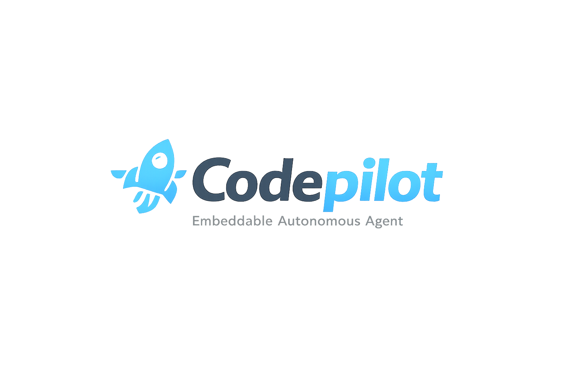
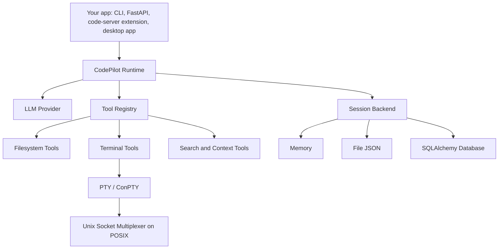
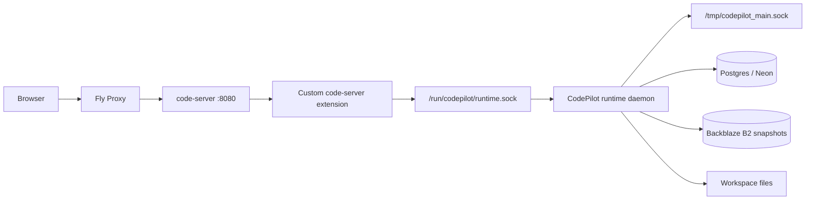
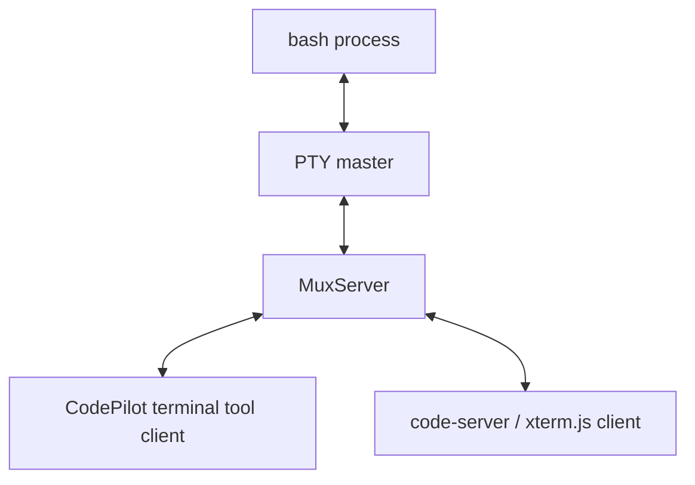

<div align="center">



### Embeddable Autonomous Agent Runtime for Software Engineering

[](https://pypi.org/project/codepilot-ai/)
[](https://pypi.org/project/codepilot-ai/)
[](LICENSE)
[](https://Jahanzeb-git.github.io/codepilot/)

**Embeddable Autonomous Agent (EAA)** • **Code-as-Interface Runtime** • **Terminal Multiplexer** • **MIT Licensed**

```bash
pip install codepilot-ai
```

</div>

## What CodePilot Is

CodePilot is a Python library for embedding autonomous software-engineering agents into your own products: CLIs, FastAPI services, hosted code-server workspaces, internal developer tools, CI repair systems, and local automation.

It is intentionally **not** a hosted chatbot UI. The package gives applications a runtime: model inference, tool execution, file editing, terminal control, persistence, hooks, and completion semantics. You bring the product surface, auth model, sandbox, database, and deployment strategy.

**Version:** `0.9.12`

Full user documentation lives at: **https://Jahanzeb-git.github.io/codepilot/**

## Quick Start

Create an `agent.yaml`:

```yaml
agent:
  name: CodePilot
  role: Autonomous software engineering agent.

  model:
    provider: anthropic
    name: claude-sonnet-4-5
    api_key_env: ANTHROPIC_API_KEY

  runtime:
    work_dir: ./workspace
    max_steps: 20
    unsafe_mode: false

  tools:
    - name: read_file
      enabled: true
    - name: write_file
      enabled: true
    - name: execute
      enabled: true
      config:
        require_permission: true
    - name: read_output
      enabled: true
    - name: send_input
      enabled: true
    - name: terminate_terminal
      enabled: true
    - name: find
      enabled: true
```

Gemini can be configured with a Gemini API key from Google AI Studio:

```yaml
agent:
  model:
    provider: gemini
    name: gemini-3.5-flash
    api_key_env: GEMINI_API_KEY
```

Run the agent:

```python
from codepilot import Runtime, on_stream, on_finish

runtime = Runtime("agent.yaml", stream=True)

@on_stream(runtime)
def stream(text: str, **_):
    print(text, end="", flush=True)

@on_finish(runtime)
def finish(summary: str, **_):
    print(f"\nDone: {summary}\n")

summary = runtime.run("Inspect the project and fix the failing tests.")
print(summary)
```

Async applications should use `AsyncRuntime`:

```python
from codepilot import AsyncRuntime

runtime = AsyncRuntime("agent.yaml", session="db", db=async_engine, stream=True)
summary = await runtime.run("Refactor the repository layer to use async SQLAlchemy.")
```

## Architecture

CodePilot is designed as a library-first runtime that can be embedded under many product surfaces.



For hosted web IDE deployments, the intended shape is a small control plane plus disposable per-user runtime machines:



## Why Code-as-Interface

Most agent frameworks force the model to express actions as JSON function calls. CodePilot instead asks the model to write Python inside a fenced `codepilot` control block:

````markdown
I will inspect the failing test first.

```codepilot
read_file("tests/test_api.py")
execute("main", "pytest tests/test_api.py -q", timeout=30)
```
````

The runtime executes only the `codepilot` block. Ordinary `python` markdown remains display text and is never executed.

This design is useful because software work is naturally procedural:

- Agents often need several tool calls in a deliberate order.
- Tool results need to feed control flow inside the same step.
- File writes need structured side-loaded payloads, not fragile escaped strings.
- Developers need observable execution results, not opaque function-call envelopes.

The model still operates under a strict protocol:

- `codepilot` block: executable control code.
- Payload blocks: file content consumed by `write_file()`.
- `completion` block: explicit task-finished signal.

This aligns with research showing that LLM agents benefit from interleaving reasoning and environment actions, as in ReAct, and from well-designed agent-computer interfaces for software engineering tasks.

## How File Editing Works

`write_file()` never accepts file content as an inline string. Content comes from the next payload block, in order. This avoids escaping failures, malformed JSON arguments, and partial string corruption.

Single file creation:

````markdown
```codepilot
write_file("config.py", mode="w")
```

```python filename=config.py
TIMEOUT = 30
RETRIES = 3
```
````

Line-based edit:

````markdown
```codepilot
file_editor("config.py", mode="edit")
```

```python filename=config.py
<<<<<<< SEARCH
TIMEOUT = 30
=======
TIMEOUT = 60
>>>>>>> REPLACE
```
````

Multiple non-contiguous edits in one file:

````markdown
```codepilot
file_editor("routes/profile.py", mode="edit")
```

```python filename=routes/profile.py
<<<<<<< SEARCH
def get_profile():
    return {}
=======
def get_profile():
    return {"status": "ok"}
>>>>>>> REPLACE
<<<<<<< SEARCH
def update_profile():
    pass
=======
def update_profile(data):
    save(data)
>>>>>>> REPLACE
```
````

Safety properties:

- Paths are constrained to `runtime.work_dir` unless `unsafe_mode: true`.
- Edits are validated using exact block matching before mutation.
- Multiple edits to the same file are processed sequentially.
- Tool results are appended back into the conversation as ground truth.

## How Terminal Tools Work

CodePilot starts a default terminal session named `main` when the runtime is created. The session persists across `run()` calls.

```python
execute("main", "pytest tests/ -v", timeout=30)
```

Long-running commands return with `status: running` instead of hanging the agent:

```python
execute("server", "uvicorn app.main:app --port 8000", timeout=4, new_terminal=True)
read_output("server", timeout=10)
execute("main", "pytest tests/test_api.py -v", timeout=30)
send_input("server", "\x03", timeout=5)
```

Terminal architecture:

- Linux/macOS use `pexpect` and a PTY.
- Windows 10 1809+ uses ConPTY through `pywinpty`.
- POSIX terminal sessions are exposed through a Unix socket multiplexer.
- Multiple clients can attach to the same terminal stream, enabling a code-server extension or xterm.js bridge to share the shell with the agent.



## Persistence Model

Session backends are selected at runtime construction:

```python
Runtime("agent.yaml")                                      # memory
Runtime("agent.yaml", session="file", session_id="demo")   # JSON file
Runtime("agent.yaml", session="db", db_url="sqlite:///./codepilot.db")
```

For async web apps, pass the engine your application owns:

```python
from sqlalchemy.ext.asyncio import create_async_engine
from codepilot import AsyncRuntime

engine = create_async_engine(
    DATABASE_URL,
    pool_size=5,
    max_overflow=10,
    pool_pre_ping=True,
)

runtime = AsyncRuntime("agent.yaml", session="db", db=engine)
```

Important deployment rule:

> A SQLAlchemy engine is a local process object, not the database. Different processes or MicroVMs should create their own engine or receive their own engine from the application process, even if all engines point to the same Postgres database.

## Observability and Product Integration

Hooks are the UI and orchestration contract:

```python
from codepilot import EventType

runtime.hooks.register(
    EventType.STREAM,
    lambda text, **_: send_to_ui({"type": "stream", "text": text}),
)

runtime.hooks.register(
    EventType.TOOL_CALL,
    lambda tool, args, label="", **_: send_to_ui({
        "type": "tool_call",
        "tool": tool,
        "label": label,
        "args": args,
    }),
)

runtime.hooks.register(
    EventType.TOOL_RESULT,
    lambda tool, result, **_: send_to_ui({
        "type": "tool_result",
        "tool": tool,
        "result": result,
    }),
)
```

This allows applications to stream progress, render tool timelines, request approvals, inject mid-task messages, and persist final summaries without coupling the UI to runtime internals.

## Security Model

CodePilot gives agents real software-engineering capabilities. The runtime is not a security sandbox by itself.

Recommended production posture:

- Run untrusted workspaces inside containers, MicroVMs, or OS sandboxes.
- Use `unsafe_mode: false` by default.
- Gate shell execution with `require_permission: true`.
- Use short-lived machine/session tokens in hosted workspaces.
- Keep user auth, runtime auth, and database credentials separate.
- Prefer disposable machines plus Postgres/object-storage persistence for hosted demos.

## Research Grounding

CodePilot’s design is influenced by agent and tool-use research:

- [ReAct: Synergizing Reasoning and Acting in Language Models](https://arxiv.org/abs/2210.03629) motivates interleaving reasoning traces with environment actions.
- [Toolformer: Language Models Can Teach Themselves to Use Tools](https://arxiv.org/abs/2302.04761) studies when models should call tools, what arguments to pass, and how to incorporate results.
- [SWE-agent: Agent-Computer Interfaces Enable Automated Software Engineering](https://arxiv.org/abs/2405.15793) argues that software agents benefit from purpose-built interfaces for navigating repositories, editing files, and running programs.
- [Voyager: An Open-Ended Embodied Agent with Large Language Models](https://arxiv.org/abs/2305.16291) demonstrates the value of agents that accumulate skills while acting in an external environment.

CodePilot translates those ideas into a small Python library focused on practical software work: executable control blocks, payload-backed file edits, persistent terminals, observable hooks, and pluggable session storage.

## Documentation

The README is intentionally architectural. Use the documentation site for library usage:

- Installation and AgentFile configuration
- Runtime and streaming behavior
- File, terminal, search, and context tools
- Session persistence
- Hooks and permission gating
- FastAPI and hosted workspace patterns
- API reference

Docs: **https://Jahanzeb-git.github.io/codepilot/**

## License

MIT License. See [LICENSE](LICENSE).
